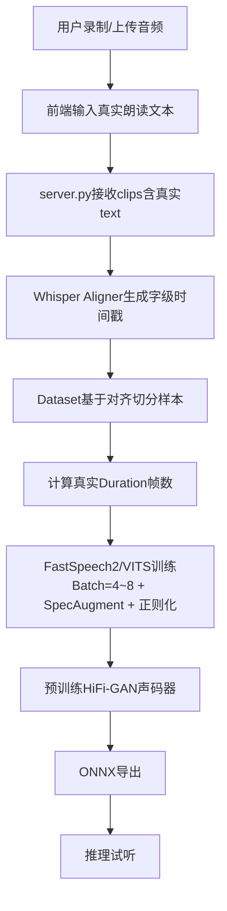

## Product Overview

基于现有轻量级TTS架构（FastSpeech2-lite / VITS-lite）的声音克隆项目，当前存在前端硬编码训练文本、无强制音频-文本对齐、Duration粗暴估算、声码器从头训练过拟合等根本性缺陷，导致克隆效果不可接受。本次优化在保持架构轻量、不引入大型预训练TTS骨干的前提下，通过修复数据链路质量、引入Whisper强制对齐、集成预训练声码器和优化训练策略，实现基于1-5分钟参考音频的真人级别声音克隆。

## Core Features

- 前端支持为每段录音/上传音频绑定真实朗读文本，取代硬编码故事文案
- 基于Whisper的字级音频-文本强制对齐，替代时间比例切分的粗糙假设
- 从对齐结果精确计算音素级Duration目标值，训练FastSpeech2 Duration Predictor
- 训练策略优化：动态Batch Size（利用12GB显存）、SpecAugment数据增强、Dropout/Weight Decay正则化、Early Stopping
- 预训练通用HiFi-GAN声码器替代原项目仅在参考音频上训练1500步的易过拟合声码器
- 修复拼音韵母未收录问题，增加字符级Fallback编码，保障训练样本不丢失
- ONNX导出与推理流程适配新训练结构

## Tech Stack Selection

- **后端**：Python + PyTorch（保持现有技术栈）
- **前端**：纯HTML5 / CSS3 / JavaScript（保持现有技术栈）
- **新增依赖**：`openai-whisper`（强制对齐）、保留`torchaudio` / `librosa`
- **预训练资源**：通用HiFi-GAN声码器权重（首次运行时自动下载缓存）

## Implementation Approach

以**"数据质量修复"**为核心策略，不更换FastSpeech2-lite / VITS-lite模型骨干，通过以下手段在轻量架构上最大化克隆效果：

1. **文本真实性修复**：前端移除硬编码`STORY`故事文本，用户在录制/上传每段音频时输入其真实朗读内容，从根本上解决训练数据的文本-音频不匹配问题。
2. **强制对齐（最关键）**：集成`openai-whisper` base模型（~74M，速度与精度平衡）生成字级时间戳，替代`dataset.py`中"按时间比例分配文本"的错误假设，建立精确的音频-文本映射。对齐结果本地缓存，避免重复计算。
3. **Dataset与Duration重构**：基于Whisper对齐结果切分训练样本，每个音素的Duration目标值从真实对齐帧数计算（`mel_frame_end - mel_frame_start`），彻底取代`train.py`中`base_dur = m_len / t_len`的粗暴平均值估算，使Duration Predictor能够学到真实的语速与停顿节奏。
4. **训练策略优化**：利用12GB显存将batch size从固定1提升至4-8；引入SpecAugment（时域掩码+频域掩码）增强泛化；在FastSpeech2 Encoder/Decoder中添加Dropout(0.1)；设置Weight Decay(1e-4)抑制过拟合；增加Gradient Clipping(max_norm=1.0)与Early Stopping(patience=20)，避免在1-5分钟小数据上训练崩溃或严重过拟合。
5. **预训练声码器**：移除原项目中`_train_hifigan`仅在用户音频上训练1500步的逻辑，引入在大型语料上预训练的通用HiFi-GAN权重。推理阶段直接调用预训练声码器将Mel谱转换为高质量波形，解决金属音、爆音和泛化差的问题。如权重下载失败，优雅降级至Griffin-Lim。
6. **文本编码鲁棒性**：在`text_processor.py`中对未收录韵母增加字符级拆分Fallback（如未知韵母按字拆分并使用`<unk>`标记），避免编码失败导致整段音频被丢弃。

## Implementation Notes

- **性能**：Whisper base在GPU上对1分钟中文音频对齐耗时约3-5秒，1-5分钟总对齐耗时可控；对齐结果以JSON格式缓存到`models/cache/`目录，同一音频不复算。
- **Blast radius控制**：保留原有ONNX导出逻辑框架，仅修改与Duration输入相关的维度处理；`server.py`的`/api/start-training`等API接口URL与请求格式保持不变，仅内部`clips`的`text`字段来源从前端真实输入获取。
- **资源管理**：预训练HiFi-GAN权重首次运行时从HuggingFace镜像自动下载至`models/pretrained/`，大小约50-100MB；下载失败时打印警告并降级，不影响主流程。
- **Logging**：复用现有logger，在对齐阶段记录Whisper模型加载信息，在训练阶段记录batch size、增强开关、正则化系数等关键配置，便于后续调试。

## Architecture Design

系统保持现有的"前端 -> Flask后端 -> PyTorch训练 -> ONNX推理"三层架构，核心改动集中在数据层和训练策略层：



### 目录结构

```
project-root/
├── index.html                  # [MODIFY] 前端：移除STORY卡片，增加每段音频文本输入
├── server.py                   # [MODIFY] 后端：传递真实text字段，调整训练参数默认配置
├── requirements.txt            # [MODIFY] 添加openai-whisper等依赖
└── trainer/
    ├── aligner.py              # [NEW] Whisper强制对齐模块：align_audio_text()生成字级时间戳
    ├── vocoder.py              # [NEW] 预训练声码器封装：加载通用HiFi-GAN权重，mel2wav推理
    ├── augment.py              # [NEW] 数据增强：SpecAugment（TimeMasking + FrequencyMasking）
    ├── dataset.py              # [MODIFY] VoiceDataset：基于aligner结果切分，返回真实duration
    ├── train.py                # [MODIFY] 移除HiFi-GAN训练，增加正则化/早停/动态batch/增强
    ├── text_processor.py       # [MODIFY] 增加韵母Fallback编码逻辑
    ├── hifigan_lite.py         # [MODIFY] 保留Generator结构用于推理，移除训练相关代码
    └── export_onnx.py          # [MODIFY] 适配新的Duration输入与预训练声码器路径
```

## 设计内容描述

当前前端为单页三步骤流程应用（准备 -> 录制 -> 训练 -> 完成）。本次改造聚焦在**Step 2 录制语音环节**，移除原有的"朗读文案"固定故事卡片，改为**每段音频独立绑定真实文本**的交互模式。

### 页面规划

仅改造核心交互页（Step 2），其余步骤保持现有视觉风格。

### Step 2 录制语音页块设计

1. **顶部提示栏**：移除原有的STORY故事盒子，替换为操作提示"请为每段录音输入您朗读的真实文字，这将直接影响克隆效果"。
2. **音频卡片列表**：每录制或上传一段音频，生成一个卡片。卡片左侧为音频波形/播放按钮，右侧上半部分显示音频时长与文件名，**右侧下半部分新增多行文本输入框**，默认提示"请输入这段音频的真实朗读内容"。
3. **快捷操作区**：在每张卡片的文本输入框下方增加"从文件导入文本"按钮（可选）和字数统计。
4. **全局控制栏**：底部保持"开始训练"按钮，但在按钮上方增加数据质量提示，如"已绑定X段文本，建议每段至少3秒"。
5. **试听对比区（Step 4）**：在训练完成后的试听区域，保持现有布局，但增加显示当前使用的参考音频文本摘要，帮助用户确认数据正确性。

### 交互细节

- 文本输入框支持实时保存到前端状态`S.clips`，用户切换步骤不丢失。
- 开始训练时，若某段音频未填写文本，弹出确认提示"该段音频未填写文本，将使用默认故事文本，可能影响克隆效果"。
- 输入框获得焦点时，卡片边框高亮（primary色），强化当前编辑对象。

### 响应式

- 保持现有的移动端适配逻辑，音频卡片在小屏幕下垂直堆叠，文本输入框全宽显示。

## Agent Extensions

### SubAgent

- **code-explorer**
- Purpose: 在关键模块重构完成后，跨文件审查代码一致性，确保新增的对齐模块、Dataset、训练流程和声码器模块之间的接口契约匹配，避免运行时错误。
- Expected outcome: 产出一份跨模块接口一致性报告，标注潜在的类型不匹配或缺失导入。